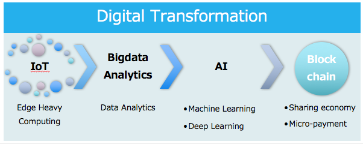
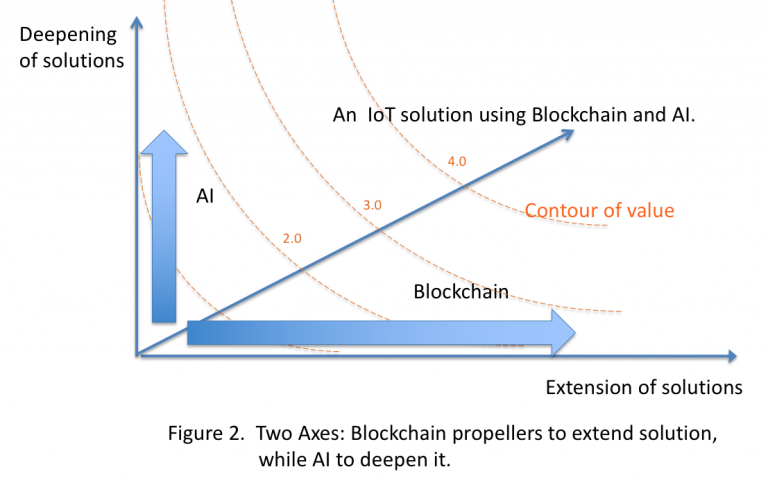

# ABC Strategy - Applying Blockchain to IoT

We see four technologies in the digital transformation recently emphasized. First of all, field data are gathered at IoT site. Because they are usually big data, they are processed as such. Next, the data should be analyzed by smarter algorithms (sometimes called as AI) to identify the essential factors, and then stored in Blockchain and shared by stakeholders in secured and non-tampering manner  to form applications. The following Figure 1 shows these four items and value transmission among them, which leads to data circulation and yields additional applications.

Figure 1. Four technologies in the digital transformation

We think it important to process this value transmission in a connected and consistent manner because IoT application needs “total engineering” and because the four technologies are still treated separately.

Moreover, Kaula identifies that there are characteristic differences among AI and Blockchain which are applied to IoT applications. Blockchain is a technology to extend usages. While IoT enlarges of the physical world that we can treat, Blockchain enables new stakeholders to join in and share the value chaining. On the other hand, AI is a technology to make the data more valuable and more competitive. Figure 2 shows two axes; Deepening of solutions (A axis by AI) and Extension (BC axis by Blockchain) with their contour of solution value. Please note that the shape of the contour is concave.

Figure 2. Two Axes: Blockchain propellers to extend solution, while AI to deepen it.

An example is that data from IoT can be stored in safe and non-tampering to be used by new stakeholders with their business models. But Blockchain does not say anything, if the input data is true or not. Some data checking by AI which also sees other environmental data can add a value that the input data is true. 

http://kaula.jp/
